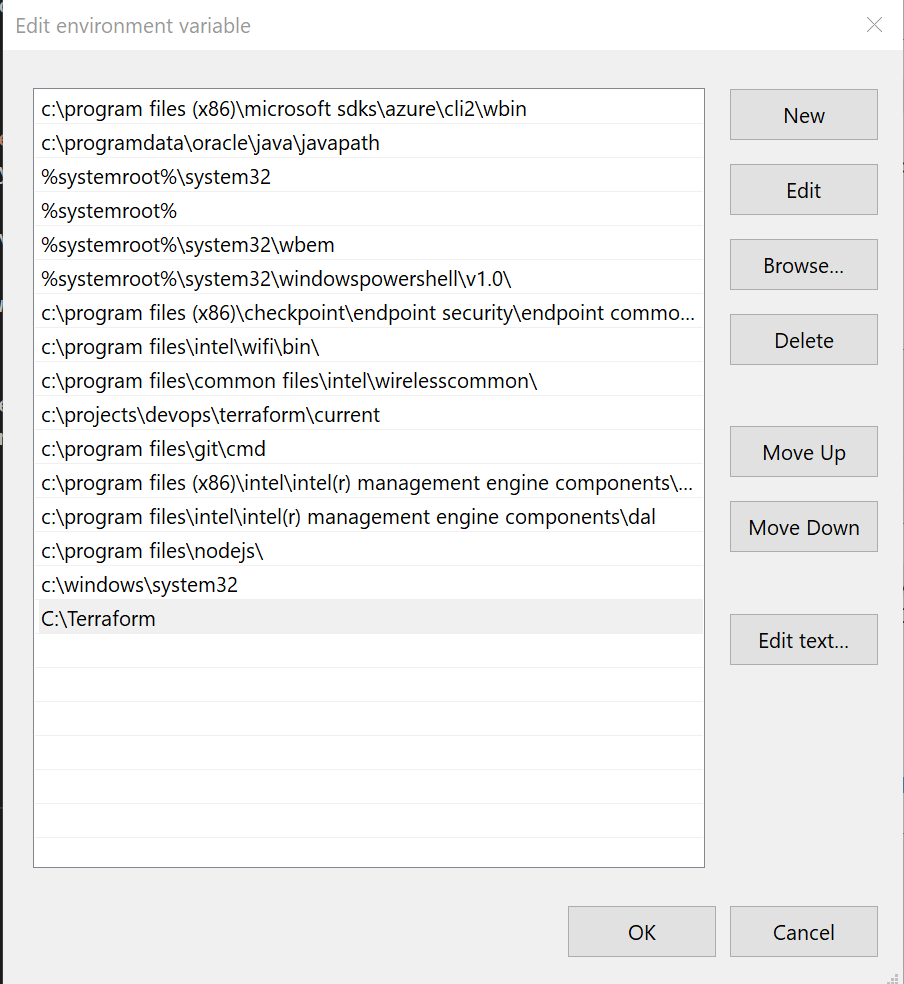
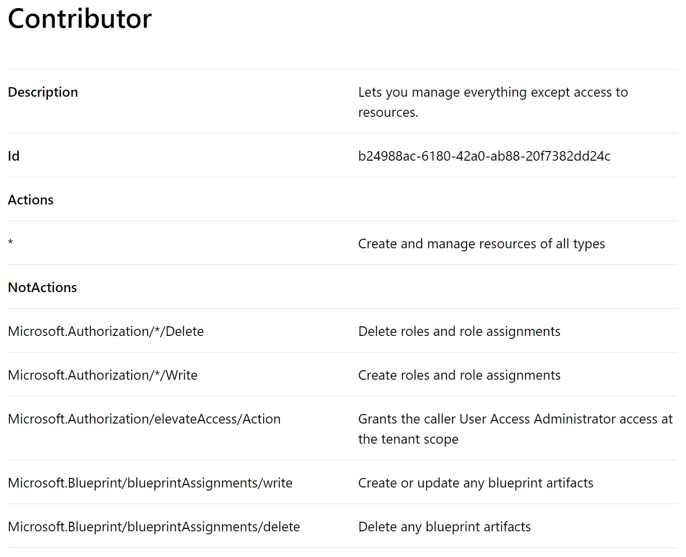

# How To - Getting started with Terraform in Azure

## Table of Contents  

[Introduction](#introduction)

[Aim](#aim)

[Setup VS Code](#setup-vs-code)

[Setup Azure CLI](#setup-azure-cli)

[Terraform LifeCycle](#Terraform-LifeCycle)

[Terraform Azure Provider](#Terraform-Azure-Provider)

[Install and configure Terraform](#Install-and-configure-Terraform)

[Next Steps](#Next-Steps)

[External Links](#external-links)

## Introduction

Terraform is an open source tool that allows you to define infrastructure for a variety of cloud providers (e.g. AWS, Azure, Google Cloud, DigitalOcean, etc.) using a simple, declarative programming language and to deploy and manage that infrastructure using a few CLI commands. See [A Comprehensive Guide to Terraform](https://blog.gruntwork.io/a-comprehensive-guide-to-terraform-b3d32832baca) for more information.

## Aim

This document outlines the process to getting started with Terraform.
Once you have walked through the document you will have a Terraform installed, configured and tested with a script that can be executed against a selected Azure subscription.

## Setup VS Code

Developers will require a development environment to develop Terraform scripts. The recommendation is to use VS Code. For instructions on how to install VS Code and connect to GitHub see [Setup VS Code](https://github.dxc.com/wm/Pipeline-Pilot/blob/Stiven/doc/Setup-VSCode.md)

## Setup Azure CLI

### Download and Install

Developers are required to install Azure CLI. Navigate to this [link](https://docs.microsoft.com/en-us/cli/azure/authenticate-azure-cli?view=azure-cli-latest#sign-in-interactively) for instructions.

### Sign in

Before running Terraform commands developers are required to login. The commands are to be executed within VS Code. Navigate to this [link](https://docs.microsoft.com/en-us/cli/azure/install-azure-cli?view=azure-cli-latest) for instructions.

**Note**:

- The browser may open *behind* VS Code.

## Terraform LifeCycle

This section describes the key Terraform commands.

### Terraform Init

The [terraform init](https://www.terraform.io/docs/commands/init.html) command is used to initialise a working directory containing Terraform configuration files. This is the first command that should be run after writing a new Terraform configuration or cloning an existing one from version control. It is safe to run this command multiple times.

Note the `init` command should be accompanied by the `-upgrade` switch to force the download of modules to be redone.

### Terraform Validate

The [terraform validate](https://www.terraform.io/docs/commands/validate.html) command is used to validate the syntax of the terraform files. Terraform performs a syntax check on all the terraform files in the directory, and will display an error if any of the files doesn't validate.

### Terraform Plan

The [terraform plan](https://www.terraform.io/docs/commands/plan.html) command is used to create an execution plan. Terraform determines what actions are necessary to achieve the desired state specified in the configuration files.

This command is a convenient way to check whether the execution plan for a set of changes matches your expectations without making any changes to real resources or to the state.

### Terraform Apply

The [terraform apply](https://www.terraform.io/docs/commands/apply.html) command is used to apply the changes required to reach the desired state of the configuration, or the pre-determined set of actions generated by a terraform plan execution plan.
Note that this command will ask for confirmation to proceed unless you include the switch *-auto-approve*.

### Terraform Destroy

The [terraform destroy](https://www.terraform.io/docs/commands/destroy.html) command is used to destroy the Terraform-managed infrastructure.
Note that this command will ask for confirmation to proceed unless you include the switch *-auto-approve*.

## Terraform Azure Provider

The Azure Provider can be used to configure infrastructure in Microsoft Azure using the Azure Resource Manager API's.
A different provider is required for each platform for example, Azure, AWS or Google Cloud.

See [Azure Provider](https://www.terraform.io/docs/providers/azurerm/) for more information.

Note that we have adopted a standard to always include the version property as shown in the sample code below.

    provider "azurerm" { 
        version = '=1.30.1' 
    }

## Install and configure Terraform

The article found at [Install and configure Terraform to provision VMs and other infrastructure into Azure](https://docs.microsoft.com/en-us/azure/virtual-machines/linux/terraform-install-configure) describes how to:

- Use Azure Cloud Shell
- Install Terraform
- Set up Terraform access to Azure
- Configure Terraform environment variables
- Run a sample script

Note, the following are changes and supporting information to the instructions described within the article:

1. Download the required Windows version of Terraform from [Terraform's Releases Page](https://releases.hashicorp.com/terraform/0.12.3/).
   - Note: Ensure you download Terraform for the correct operating system. This will most likely be *terraform_0.12.3_windows_amd64.zip*.
   - Note: Ensure you download *v0.12.3* of Terraform
2. Supporting instructions on how to update the Windows PATH environment variable for Terraform
   1. In Windows Explorer, right-click on *This PC* and select *Properties*.
   2. Click on *Advanced System Settings* > *Environment Variables*
   3. In *System Variables*, select *Path* then *Edit*.
   4. In the new blank row at the bottom enter the full path to the Terraform folder created earlier, click *OK* to close all windows.

3. Note the recommendation above to include the version number when using the *Terraform Azure Provider*.
4. Suggestion is to not continue with the follow-up article [Creating an Azure VM with Terraform](https://docs.microsoft.com/en-us/azure/virtual-machines/linux/terraform-create-complete-vm) and instead focus on learning how to utlise the reusable Terraform module developed by the Automation team.
5. The Azure Service Principal created to provide Terraform access to the Azure subscription is added to the  [Contributor role](https://docs.microsoft.com/en-us/azure/role-based-access-control/built-in-roles#contributor). Below is an overview of the permissions granted to this role.

Key Additional Notes:

We recommend to limit the scope of the Service Principal to an Azure Resource Group. The example command below shows how to do this.

    az ad sp create-for-rbac -n "MyApp" --role contributor \
    --scopes subscriptions/${SUBSCRIPTION_ID}/resourceGroups/{ResourceGroup}  

## Next Steps

In this article, you installed VS Code, Terraform and used the Cloud Shell to configure Azure credentials to start creating resources in your Azure subscription. To create a more complete Terraform deployment in Azure, see the following article [Terraform Configuration and Modules in Azure](https://github.dxc.com/wm/Pipeline-Pilot/blob/Stiven/doc/Terraform-Configuration-and-Modules-in-Azure.md).

## External Links

1. [Getting Started with Terraform](https://confluence.csc.com/display/SPA/Getting+Started+with+Terraform)
2. [VM Provisioning Failures and Quotas](https://confluence.csc.com/display/SPA/VM+Provisioning+Failures+and+Quotas)
3. [Terraform Requirements](https://confluence.csc.com/display/SPA/Terraform+Requirements)
4. [Internal Terraform Demo - 21 Jan 2019](https://confluence.csc.com/display/SPA/Internal+Terraform+Demo+-+21+Jan+2019)
5. [How to Destroy specific resources using Terraform](https://confluence.csc.com/display/SPA/How+to+Destroy+specific+resources+using+Terraform)
6. [Internal Pipeline Demo - 12 Jul 2019](https://web.microsoftstream.com/video/da2b92d7-b90a-4d5b-9e90-ca664537453b)
7. [PDXC Terraform Example - GitHub Repo](https://github.dxc.com/Platform-DXC/Terraform-Example)
