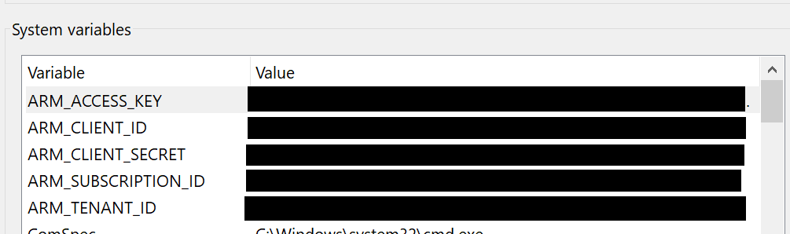

# How To - Running SFS Terraform Locally

## Table of Contents  

[Introduction](#introduction)

[Aim](#aim)

[GitHub Repository](#github-repository)

[Configure Environment Variables](#configure-environment-variables)

[Executing Terraform](#executing-Terraform)

[External Links](#external-links)

## Introduction

Please ensure you have read and executed the following guides:

- [Getting started with Terraform in Azure](https://github.dxc.com/wm/Pipeline-Pilot/blob/master/doc/Getting-started-with-Terraform-in-Azure.md)
- [Terraform Configuration and Modules in Azure](https://github.dxc.com/wm/Pipeline-Pilot/blob/master/doc/Terraform-Configuration-and-Modules-in-Azure.md)

This document outlines the steps to:

- clone the SFS Terraform repository.
- prepare your developer workstation.
- execute the Terraform scripts on your developer workstation.

## Aim

Once you have walked through the document you will have the SFS Terraform scripts configured and tested against a selected Azure subscription.
A key goal of this article to to configure Terraform so that the local (on your developer workstation) execution utlises the same code and configuration as that executed in the CI\CD Pipeline.

## GitHub Repository

The SFS Terraform scripts can be found at [Pipeline-Pilot](https://github.dxc.com/wm/Pipeline-Pilot). [Clone](https://help.github.com/en/articles/cloning-a-repository) this repository.

## Configure Environment Variables

As discussed in the guide [Getting started with Terraform in Azure](https://github.dxc.com/wm/Pipeline-Pilot/blob/master/doc/Getting-started-with-Terraform-in-Azure.md) environment variables must be configured to support the execution of Terraform.

### Additional Environment Variables

In addition to the environment variables created in the above article those listed below are also required. These PowerShell commands will create environment variables on your developer workstation and must be executed within the PowerShell console:

    [Environment]::SetEnvironmentVariable("TF_VAR_ARM_ACCESS_KEY", "...place storage access key here...", "Machine")

    [Environment]::SetEnvironmentVariable("TF_VAR_REGION", "...place region here...", "Machine")

    [Environment]::SetEnvironmentVariable("TF_VAR_ADMIN_ACCOUNT", "LabAdmin", "Machine")

    [Environment]::SetEnvironmentVariable("TF_VAR_ADMIN_PASSWORD", "...place Lab Admin password here...", "Machine")

Note:

- in the pipeline the sensitive information is stored with the Jenkins and Azure credential stores.
- the value for *TF_VAR_ARM_ACCESS_KEY* that stores the Backend (Remote) Terraform state file. See [Terraform Configuration and Modules in Azure](https://github.dxc.com/wm/Pipeline-Pilot/blob/master/doc/Terraform-Configuration-and-Modules-in-Azure.md) for more information on how to get this value. To query for the storage key execute the command below in the Azure CLI, note replace *$STORAGE_ACCOUNT_NAME* with the name of your storage account:

    az storage account keys list --account-name $STORAGE_ACCOUNT_NAME

- the value for *TF_VAR_ADMIN_PASSWORD* is the password of the local administrator on the Azure Virtual Machines provisioned by Terraform.

### Validate Environment Variables

In the guide [Getting started with Terraform in Azure](https://github.dxc.com/wm/Pipeline-Pilot/blob/master/doc/Getting-started-with-Terraform-in-Azure.md) the  environment variables below would have been created. Please ensure that these values belong to the Azure subscription you plan to execute Terraform against.

- ARM_SUBSCRIPTION_ID
- ARM_CLIENT_ID
- ARM_CLIENT_SECRET
- ARM_TENANT_ID

If the environment variables need to be updated the commands below can be used, note you need to enter the required values before executing:

    [Environment]::SetEnvironmentVariable("TF_VAR_ARM_SUBSCRIPTION_ID", "...place subscription id here...", "Machine")

    [Environment]::SetEnvironmentVariable("TF_VAR_ARM_CLIENT_ID", "...place client id here...", "Machine")

    [Environment]::SetEnvironmentVariable("TF_VAR_ARM_CLIENT_SECRET", "...place client secret here...", "Machine")

    [Environment]::SetEnvironmentVariable("TF_VAR_ARM_TENANT_ID", "...place tenant id here...", "Machine")

Once completed you should see the following (without the secrets hidden).

## Executing Terraform

Once the steps above have been completed open a terminal in VS Code and navigate to the folder where the file *main.tf* is located and execute the following commands in the order listed:

    terraform init -upgrade

    terraform validate

    terraform plan

    terraform apply

## External Links
