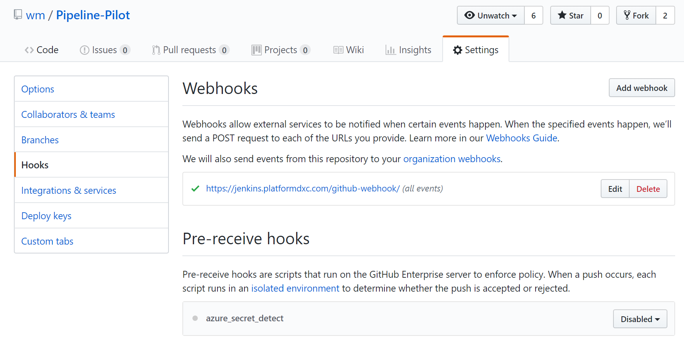
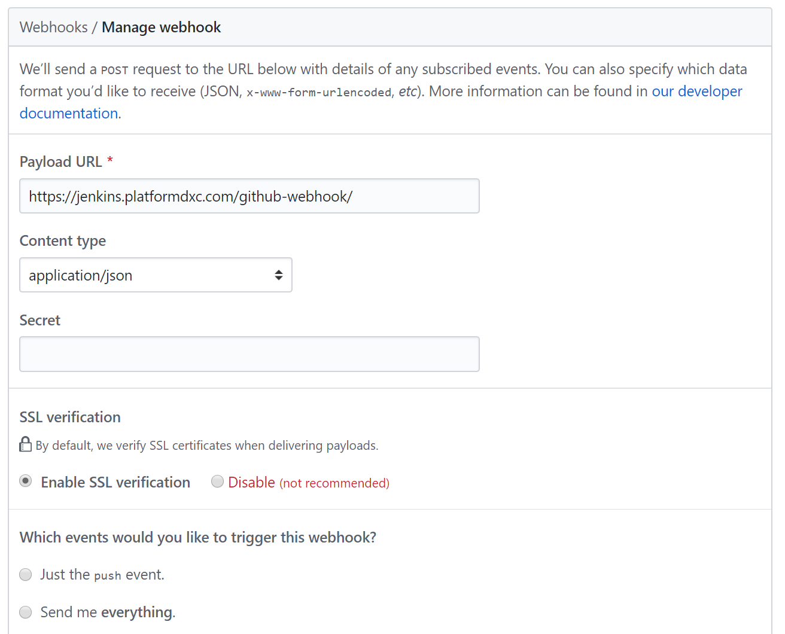
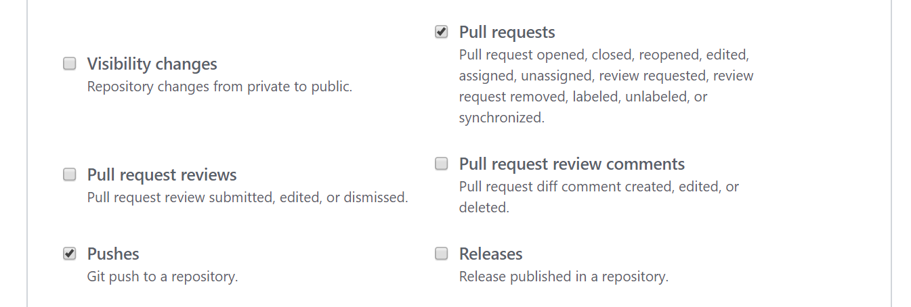

# How To - Running SFS Terraform in Jenkins

## Table of Contents  

[Introduction](#introduction)

[Aim](#aim)

[GitHub Webhook](#GitHub-Webhook)

[Jenkins](#Jenkins)

[Docker](#Docker)

[Terraform](#Terraform)

[DSC](#dsc)

[External Links](#external-links)

## Introduction

Please ensure you have read and executed the following guides:

- [Getting started with Terraform in Azure](https://github.dxc.com/wm/Pipeline-Pilot/blob/master/doc/Getting-started-with-Terraform-in-Azure.md)
- [Terraform Configuration and Modules in Azure](https://github.dxc.com/wm/Pipeline-Pilot/blob/master/doc/Terraform-Configuration-and-Modules-in-Azure.md)

This document outlines the steps to execute in order for Jenkins to execute Terraform from within the pipeline.

## Aim

At completion of this document Jenkins will be configured to execute Terraform.

## GitHub Webhook

### Overview

This section will detail the steps to have Jenkins automatically initiate a Jenkins pipeline if it detects either a push or a pull request to  a GitHub repository. For more information see
[How to Integrate Your GitHub Repository to Your Jenkins Project](https://www.blazemeter.com/blog/how-to-integrate-your-github-repository-to-your-jenkins-project/)

### Configuration

The images below provide the settings when configuring the web hook that will connect to the Jenkins platform on PDXC.

Note:

- The Payload URL is `https://jenkins.platformdxc.com/github-webhook/`
- Only two events are selected. They are, *Pushes* and *Pull Requests*.

## Jenkins

For more details on Jenkins see [Getting started with Pipeline](https://jenkins.io/doc/book/pipeline/getting-started/)

### Jenkins File

A *Jenkinsfile* is a text file that contains the definition of a Jenkins Pipeline.

The decision has been made to not use the Jenkins GUI but instead use a *Jenkinsfile*. This will allow the pipeline (as defined within the *Jenkinsfile*) to be placed into GitHub.

Jenkins supports [Groovy](http://groovy-lang.org/) syntax.

### Jenkins Credential Store

The credential store is used to keep secrets out of your script and therefore GitHub. Credentials configured in Jenkins are stored in an encrypted form.

To access a credential see the sample below. This sample returns a credential with the key *ARM_SUBSCRIPTION_ID*:

            TF_VAR_ARM_SUBSCRIPTION_ID  = credentials('ARM_SUBSCRIPTION_ID')

For more information see [Using credentials](https://jenkins.io/doc/book/using/using-credentials/)

### Jenkins Dashboard

Show how the repo presents in the dashboard

## Docker

## Terraform

## DSC

DSC is yet to be integrated into the pipeline.

## External Links
