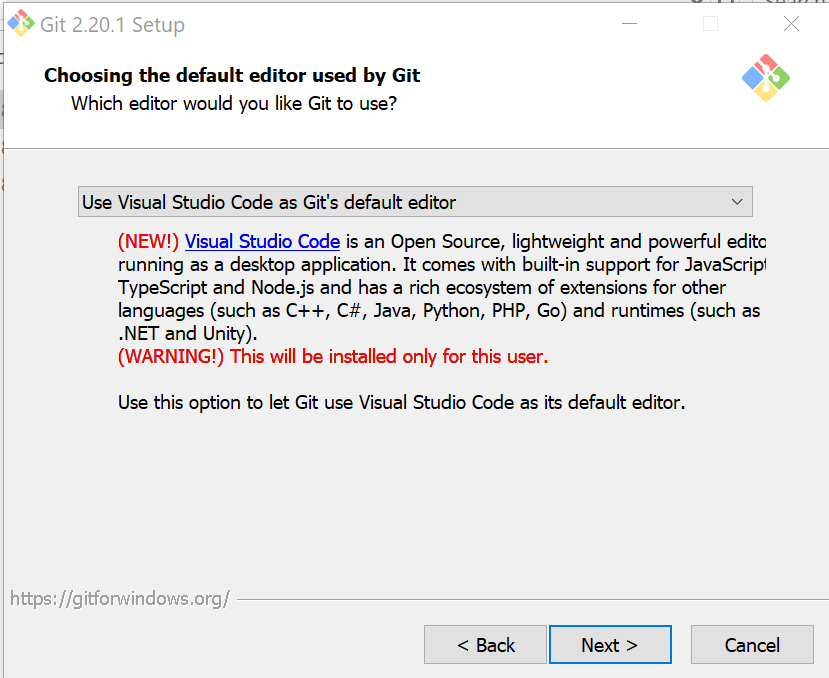
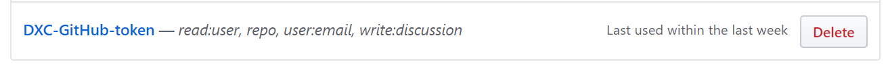
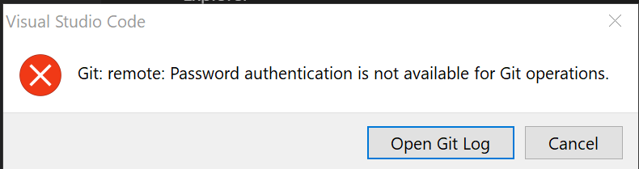
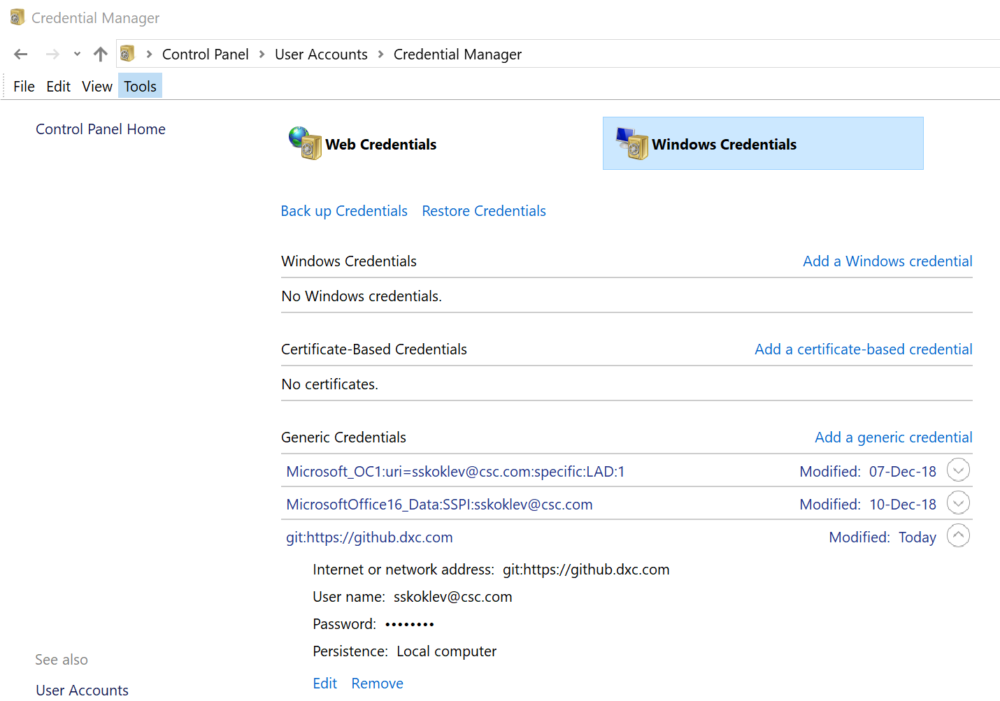

# Install and Configuring VS Code

## Table of Contents  

[Introduction](#introduction)

[Install VS Code](#Install-VS-Code)

[Configure VS Code](#Configure-VS-Code)

[Terraform Extension](#Terraform-Extension)

[VS Code Extensions](#VS-Code-Extensions)

[Install Git](#Install-Git)

[Connecting to DXC Enterprise GitHub](#Connecting-to-DXC-Enterprise-GitHub)

[External Links](#External-Links)

## Introduction

The instructions below will guide you through the installation of VS Code and suggest a number of VS Code extensions.

## Install VS Code

1. Navigate to [VS Code Downloads](https://code.visualstudio.com/download) and select the correct download based on your development environment.
2. Once it is downloaded, run the installer *VSCodeUserSetup-{version}.exe*. This will only take a minute.
   - Note: Accept all default except when you get to the page below, pay attention to the options selected.

3. By default, VS Code is installed under *C:\users\{username}\AppData\Local\Programs\Microsoft VS Code*.

- Note: .NET Framework 4.5.2 or higher is required for VS Code. If you are using Windows 7, make sure you have at least [.NET Framework 4.5.2](https://www.microsoft.com/download/details.aspx?id=42643) installed.

## Configure VS Code

### Terraform Extension

You can optionally choose to install the [Terraform VS Code extension](https://marketplace.visualstudio.com/items?itemName=ms-azuretools.vscode-azureterraform). This will enable you to execute Terraform commands from the VS Code command pallet.
Note, the additional requirement if you choose to install. Recommendation is to initially use the command line interface.

### VS Code Extensions

Below are suggested VS Code extensions. Note there are many extensions and the list below should not be considered as the only extensions to consider. There are not required to develop and execute Terraform, DSC or other scripts. These should be seen as productivity aids.

1. [Better Comments](https://marketplace.visualstudio.com/items?itemName=aaron-bond.better-comments)
2. [Git History](https://marketplace.visualstudio.com/items?itemName=donjayamanne.githistory)
3. [GitLens](https://marketplace.visualstudio.com/items?itemName=eamodio.gitlens) 
4. [.gitignore Generator](https://marketplace.visualstudio.com/items?itemName=piotrpalarz.vscode-gitignore-generator)
5. [Terraform](https://marketplace.visualstudio.com/items?itemName=mauve.terraform)
6. [PowerShell](https://marketplace.visualstudio.com/items?itemName=ms-vscode.PowerShell)
7. [Docker](https://marketplace.visualstudio.com/items?itemName=ms-azuretools.vscode-docker)
8. [Markdown Linter](https://marketplace.visualstudio.com/items?itemName=DavidAnson.vscode-markdownlint)
9. [Markdown All in One](https://marketplace.visualstudio.com/items?itemName=yzhang.markdown-all-in-one)

### Install Git

VS Code will leverage your machine's Git installation, so you need to install Git first before you get these features. 

1. Navigate to [Git downloads page](https://git-scm.com/download). Download the correct release based on your development environment.
   - Note: Make sure you install at least version 2.0.0.
2. Installing Git I accepted all the defaults except for the screen below where I choose *VS Code as the default editor*.

### Connecting to DXC Enterprise GitHub

Additional configuration is required to connect to DXC GitHub.

1. Navigate to [Authorizing a personal access token for use with a SAML single sign-on organization](https://help.github.com/en/articles/authorizing-a-personal-access-token-for-use-with-a-saml-single-sign-on-organization) and follow the instructions. Once completed you should see an entry as shown below. Note you may have chosen a different name for your token which is not an issue.

### Cloning a GitHub Repository

Note, the assumption here is that you have already created a GitHub repository. If not you can test with this url: *https://github.dxc.com/wm/Pipeline-Pilot*. To clone a repo:

1. Open the *command pallet* in VSCode (using Ctrl-Shift-p).
2. Execute the command *clone* When prompted enter your DXC GitHub repo url adding a '.git' extension to the end of the url.
3. If prompted for credentials use your DXC email address and your GitHub token, created earlier as the password.

#### Troubleshooting

After completing step 3 above, if you get the error shown below then you will need to manually correct your GitHub credentials

Resolution:

1. Navigate to credential (not web) manager as shown in the image below.
2. Find the github entry.
3. Select Edit
4. Ensure your email address is correct, enter your token as your password.
5. Try connecting again using instructions in [Connecting to DXC Enterprise GitHub](#Connecting-to-DXC-Enterprise-GitHub).

## External Links

1. [Getting Started with VS Code](https://code.visualstudio.com/docs/?dv=win).
2. [VS Code on Windows](https://code.visualstudio.com/docs/setup/windows).
