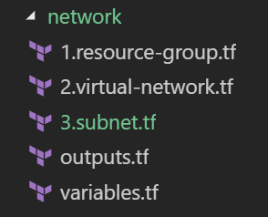
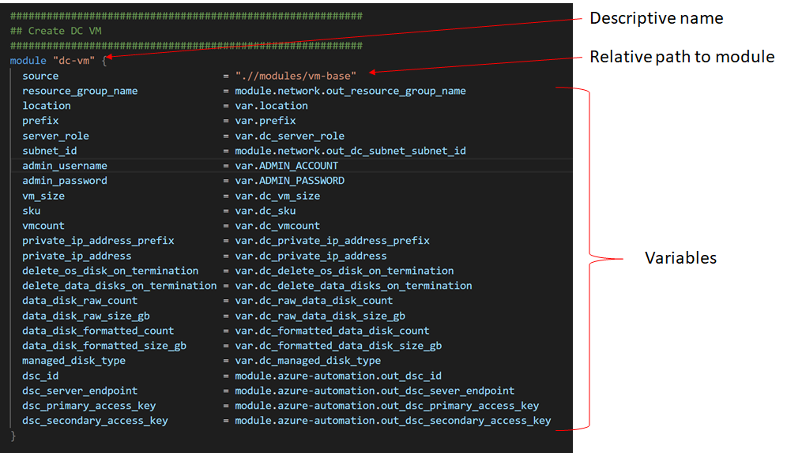

# How To - Terraform Configuration and Modules in Azure

## Table of Contents  

[Introduction](#introduction)

[Aim](#aim)

[Terraform Versioning](#Terraform-Versioning)

[Terraform Configuration](#Terraform-Configuration)

[Terraform Remote (Backend) Storage](#Terraform-Remote-(Backend)-Storage)

[Terraform Files](#Terraform-Files)

[Terraform Modules](#Terraform-Modules)

[External Links](#external-links)

## Introduction

This document assumes that the document [Getting started with Terraform in Azure](https://github.dxc.com/wm/Pipeline-Pilot/blob/master/doc/Getting-started-with-Terraform-in-Azure.md) has been followed.
This document will reference existing articles where available and focus on describing the standards tp be adhered to.

## Aim

This document outlines the process of extending the example started in [Getting started with Terraform in Azure](https://github.dxc.com/wm/Pipeline-Pilot/blob/master/doc/Getting-started-with-Terraform-in-Azure.md) to include:  

- utilizing *Terraform configuration* to develop Terraform scripts that are driven by configuration.
- enforcing the use of predefined versions of Terraform and the Azure Provider.
- configuring Terraform to utilise Backend storage to aid team development and execution of Terraform.
- executing Terraform modules.

## Terraform Versioning

Terraform recommends [pinning your versions](https://www.terraform.io/docs/providers/azurerm/guides/2.0-upgrade-guide.html#pinning-your-provider-version). This is, configuring Terraform to use a predefined version of Terraform and Terraform providers.
You should constrain the acceptable versions via configuration, to ensure that new versions with breaking changes will not be automatically installed causing builds to fail.

Key additional points:

- The Terraform blocks shown below should be stored within a Terraform script dedicated to describing the setup activities required prior to scripts that create resources. This file should be named *init.tf*.
- Versioning Terraform and the Azure providers must be set.

### Versioning Terraform

The recent upgrade of Terraform v0.12 contained a number of breaking changes. For this reason pinning the [Terraform version](https://www.terraform.io/docs/configuration/terraform.html#specifying-a-required-terraform-version) is important. The sample below shows Terraform pinned to version 0.12.3.

    terraform {
        required_version = "= 0.12.3"
    }

### Versioning Providers

This is especially important for Terraform providers as they are downloaded when the `terraform init` is executed unless you have pinned the version as shown below which shows the Azure Provider pinned to version 1.30.1.

    provider "azurerm" { 
        version = '=1.30.1' 
    }

See [Versioning](https://www.terraform.io/docs/configuration/providers.html#version-provider-versions) for more information on the syntax.

## Terraform Configuration

### Input Variables

See [Input Variables](https://www.terraform.io/docs/configuration/variables.html) for more information.

Key additional points:

- Input variables are to be used where possible to ensure your Terraform scripts are driven by configuration.
- Where input variables are used they are to be declared within a terraform script named *variables.tf*.
- The description property should be included for every declaration for easier maintenance.

### Output Variables

See [Output Variables](https://www.terraform.io/docs/configuration/outputs.html) for more information.

Key additional points:

- Where output variables are used they are to be declared within a terraform script named *outputs.tf*.
- Output variable names will be prefixed by *out_* for example *out_resource_group_name*.
- The description property should be included for every declaration for easier maintenance.

### Variable Definition (.tfvars) Files

See [Variable Definition](https://www.terraform.io/docs/configuration/variables.html#variable-definitions-tfvars-files) for more information.

Key additional points:

- Secrets must not be hard-coded into this file. Rather explore options to store secrets in credential stores such as those available within Jenkins and Azure or the use of environment variables.
- Do not use the *json* formatting option. This decision is driven solely to standardise rather than pros/cons of either option.
- Use the naming convention *.auto.tfvars*. This will support the future need to configure dev/test/prod configurations. For example by creating a *dev.auto.tfvars* file.
- Variables that are more volatile should be placed at the beginning of the tfvars files.

## Terraform Remote (Backend) Storage

See [Configuring Backend Storage](https://www.terraform.io/docs/configuration/terraform.html#configuring-a-terraform-backend) and [How to manage Terraform state](https://blog.gruntwork.io/how-to-manage-terraform-state-28f5697e68fa) for more information.

Key additional points:

- Backend storage should be used where possible.
- Variables cannot be used within the *backend* block. This is a technical constraint.
- The storage access key should not be hard-coded in the script. Rather explore options to store this key in credential stores such as those available within Jenkins and Azure or the use of environment variables.
- Utilise the script to create the Azure Storage required to host the Terraform state file. See below.

### Create Storage Account script

A script has been developed to support the creation of the storage account and container that will host the Terraform state file. The script can be found in GitHub at [Create Backend Storage Script](https://github.dxc.com/wm/Pipeline-Pilot/blob/master/setup/create-storage.sh).

Note:

- the script must be executed within the Azure CLI.
- adjust the variables in the script as required.
- pay attention to the Azure naming rules for the storage account.
- record the *Account Key* as this will be required when configuring the Backend State in Terraform

## Terraform Files

In terms of readability the Terraform configuration should not all reside within a single *Main.tf* (or similarly named) file. An example is shown in the image below.

Key Additional Points

- The name of the folder *network* helps identify the aim of the scripts. This is, to provision *network* related resources.
- The contents of the folder are a series of Terraform scripts that are named to support readability. For example, 1.resource-group.tf clearly identifies that this script will provision a resource group and this is the first resource that the series of script requires. Note that the numbers are only a visual aid and do not influence the order Terraform executes the scripts.
- The *outputs.tf* scripts clearly identifies where any output variables are to be declared.
- The *variables.tf* scripts clearly identifies where any input variables are to be declared

## Terraform Modules

See [Creating Modules](https://www.terraform.io/docs/modules/index.html) for more information.

Key Additional Points

- All modules should be placed within a modules folder below the main Terraform configuration.
- Terraform Modules have been created for the following:
  - Create Azure Automation Account
  - Create Network Related resources
  - Create Virtual Machine
- These modules can be found in GitHub at [Pipeline-Pilot](https://github.dxc.com/wm/Pipeline-Pilot/tree/master/code/modules)

## External Links

1. [How to build reusable Terraform modules with example](https://www.youtube.com/watch?v=dMzY3GiJPiY)
2. [Terraform Naming Conventions](https://www.terraform-best-practices.com/naming#usage-of-count)
3. [List Azure VM Sizes](http://www.rebeladmin.com/2017/07/setting-azure-virtual-machines-terraform/)
4. [List Terraform Releases](https://releases.hashicorp.com/terraform)
5. [List Azure Provider Releases](https://github.com/terraform-providers/terraform-provider-azurerm/releases)
